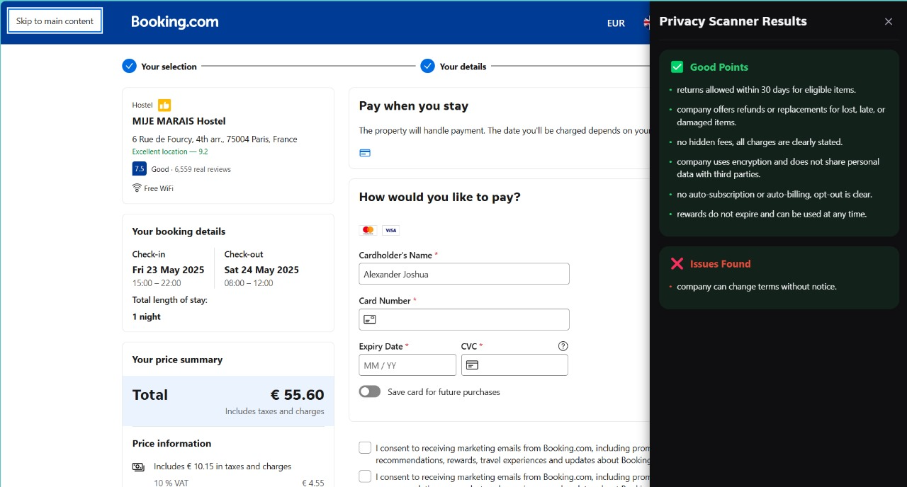

# POLICIA

## Overview

The **Polica** is a Chrome extension that reads privacy policies and terms and conditions to highlight potential concerns for the users. It leverages **Mistral**, orchestrated by **Langflow**, to analyze policy texts and detect misleading or beneficiary clauses.

The extension is built using **React**, **TypeScript**, and **Vite**.

## Features

- **Privacy Policy Analysis**: Reads and highlights key issues in policy documents.
- **Maistral & Langflow Integration**: Uses AI to provide insights into policies.
- **Chrome & Edge Support**: Works as an unpacked extension in Chromium-based browsers.

## Setup Instructions


### 1. Set Up Langflow

Langflow orchestrates the AI model to process policy documents efficiently.

#### Steps to Set Up Langflow:

1. Install Langflow using pip:
   ```sh
   pip install langflow
   ```
2. Run Langflow:
   ```sh
   langflow run
   ```
3. Open the Langflow UI (default: `http://localhost:7860`).
4. **Import the flow**:
   - Upload `Policia Scanner.json` and the `Prompt Classifier.json` into Langflow to load the predefined flow.
5. **Configure API Path**:
   - In the `langflow-api.ts` file under the `service` folder of the extension, update the API path to match your local Langflow API:
     ```typescript
     const API_ENDPOINT = "http://localhost:7860/api"; // Update if needed
     ```
### 2. Configure Mistral for Langflow
1. Inside the flow we have configured the API key just for this hackathon. Fill key otherwise.
### 3. Install & Build the Chrome Extension

The extension is built using React and TypeScript with Vite.

#### Steps to Install Dependencies:

1. Navigate to the project directory:
   ```sh
   cd "git clone directory"
   ```
2. Install dependencies:
   ```sh
   npm install
   ```

#### Steps to Build:

1. Run the following command to build the project:
   ```sh
   npm run build
   ```
2. This will generate a `dist/` folder, which contains the extension files.

### 4. Load the Extension in Chrome/Edge

1. Open Chrome and go to `chrome://extensions/` (for Edge, go to `edge://extensions/`).
2. Enable **Developer Mode** (toggle in the top-right corner).
3. Click **Load Unpacked** and select the `dist/` folder.
4. The extension should now be available in your browser!

## Final Result




---

## Future scope
Speed up the model
Move out of langflow
Dockerize it and host it on a platform

### Contributions & Feedback

Feel free to contribute, suggest improvements, or report issues via GitHub!

---

